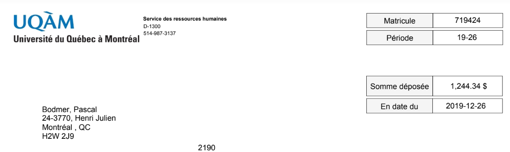
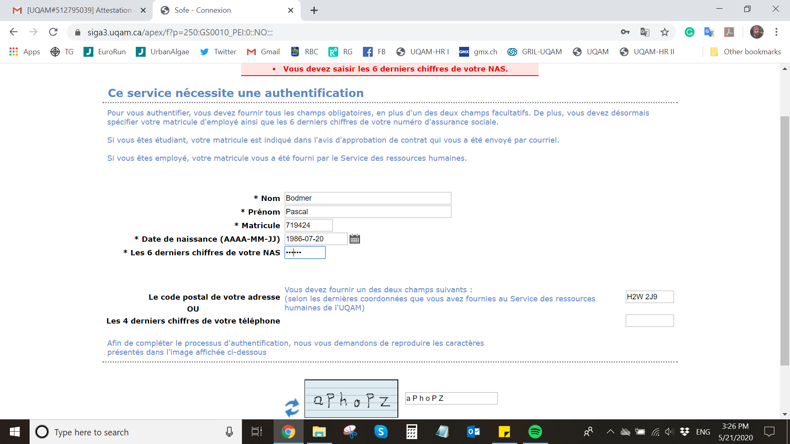
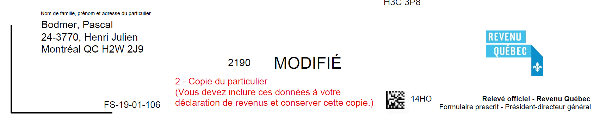
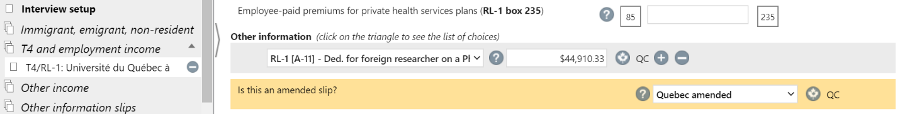
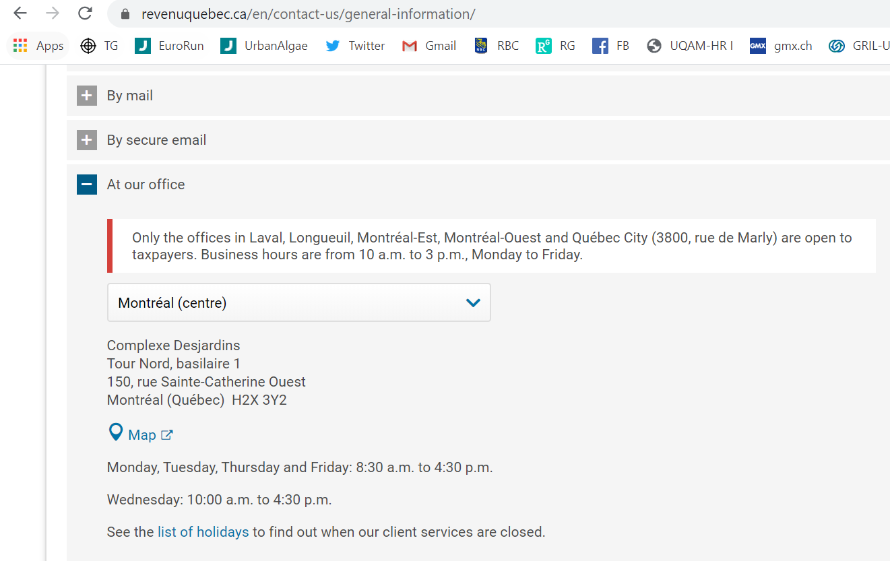
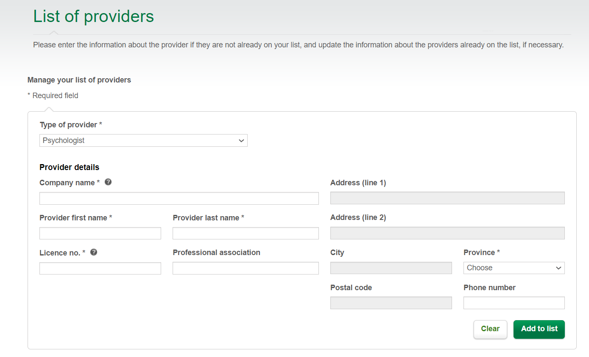
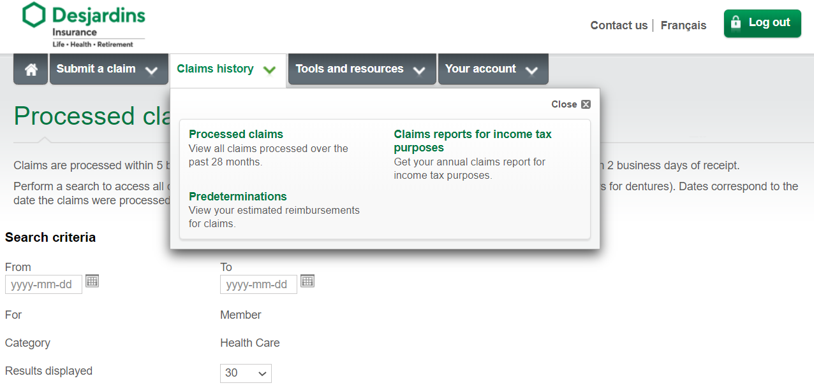

```{r, echo = F, evaluate = F}
# to knit Rmd to both PDF and HTML at the same time
# use this code in your console instead of the "Knit" button in RStudio.
#rmarkdown::render("UQAM_manual_IntStudents.Rmd", output_format ="all")
```

---

# A few words
Welcome! You are joining UQAM and you are heading towards an adventure to live in Montréal. This is a list of things that you need to do before and after arriving in Montréal, and other things are just for informative purposes. Information given here is merely to help you through the sometimes overwhelming steps until you get settled in with us. This list is not a definitive instruction, and we will try to keep the points and links updated to the best of our knowledge, but be aware that things may change and information may not be 100% accurate anymore. If there is something unclear, don't hesitate to contact any of the current lab members.

---

# Our values
  We acknowledge the right to the land on which we are working belongs to the First Nation Indigenous communities of the Kahnawà:ke, Inuit, Cree, Pessamit, and many others.

  Life is hard, and so is science. Although competitive and challenging, science should not be harder for some of us than it needs to be. We create our culture, and in the del Giorgio and Prairie labs, our culture is inclusive. We value every member of our community and want to ensure that every member and collaborator has a **positive and educational experience**.

  We aim to create an **environment free of harassment and discrimination for everyone**. Unacceptable behavior includes offensive verbal comments related to gender, sexual orientation, age, race, ethnicity, religious belief, physical appearance, body size, physical or cognitive disabilities, socioeconomic background, and deliberate intimidation, stalking, following, harassing photography or recording, sustained disruption of discussions, inappropriate physical contact, and unwelcome sexual attention. 
  
  Our expectations apply to our members, collaborators, and everyone who participates in any project with the del Giorgio and Prairie laboratories. We commit to making academia, and all spaces – physical and virtual – safe and welcoming for Black, Indigenous, and People of Color (BIPOC) and many other underrepresented minority groups. We are actively working to uplift the voices of and create spaces for underrepresented groups.
  
  This is an **ongoing, iterative process**. We pledge to continue educating ourselves, have uncomfortable conversations, and learn from each other to reduce implicit and systemic biases, not only within our group but in the larger academic community. We invite you to correct us, to hold us accountable for our actions and words, to contribute, and join us on this journey to make our community an inclusive space for all people.

  If any of these terms and issues are new to you, don’t be hard on yourself since this is a learning experience for us all. We are including more external resources for anyone who is interested in further educating themselves on these issues. 

**Useful additional readings/resources**:

- [Microaggressions](https://en.wikipedia.org/wiki/Microaggression)
- [Racial Battle Fatigue](https://en.wikipedia.org/wiki/Racial_battle_fatigue)
- [Environmental racism](https://en.wikipedia.org/wiki/Environmental_racism)
- Reference test on unconscious/implicit bias: [Project Implicit](https://implicit.harvard.edu/implicit/)

  *(Thank you to Dr. Timothee Poisot and SWS Student Section for inspiring this EDI statement.)*

---

# Students
## Before arrival
Here are some things that you will need to do before arriving in Canada (if you want to keep in mind your budget, look at the section on [our estimates](#budget) for living expenses).

### 1. UQAM admission
To register to UQAM, you have to fill in several forms. Now, you can also apply online instead of sending the documents by post!

You can find a step-by-step guide [here](https://etudier.uqam.ca/etudiants-etrangers). It is in French, but you can make use of Google Chrome and the automatic google translate option.

You’ll need to find the program number for a

* [Masters in biology](https://etudier.uqam.ca/programme?code=3440) (No. 3440)
OR
* [Doctorate in biology](https://etudier.uqam.ca/programme?code=3805) (No. 3805)
    
As mentioned above, admission can be done [online now](https://etudier.uqam.ca/admission-en-ligne). You can find the documents that will be needed [here](https://etudier.uqam.ca/documents-requis). Essentially, you will need your transcripts from previous degrees (in French or English), copy of your diploma, and other UQAM forms that need to be filled. And you have to pay the admission fee of around CAD$126 by credit card.

> **Tip**: Make sure that your passport is valid for several years! You cannot get the CAQ and study permit for longer than your passport is valid. Otherwise, you will need to renew your passport and get an extension while you’re studying (and pay the fee again).

---

### 2. CAQ
Before you can apply to a study permit, you will need the **CAQ** (Certificat d'acceptation du Quebec) which allows you to study in Québec.

UQAM is a designated learning institution (DLI# O19359011134) or check [here](https://www.canada.ca/en/immigration-refugees-citizenship/services/study-canada/study-permit/prepare/designated-learning-institutions-list.html) for more details. So once, you have the letter of admission from UQAM, you can apply fairly easily. Check the steps for CAQ application [here](http://www.immigration-quebec.gouv.qc.ca/en/immigrate-settle/students/obtaining-authorizations/certificat-acceptation/index.html).

You can [apply online](http://www.immigration-quebec.gouv.qc.ca/en/electronic-services/caq-electronic/index.html) and you will need:

* a recent ID photo (35 mm x 45 mm)
* photocopy of your passport
* letter of admission from the registrar
* pay the processing fee (~CAD$114)

Processing times vary. The average is 20 days.

---

### 3. Study permit
Once you have received the **CAQ**, you can apply for the **study permit**. Application to a study permit depends largely on which country you are from. Consult the website of the [Government of Canada](https://www.canada.ca/en/immigration-refugees-citizenship/services/study-canada/study-permit.html) for further instructions.

For sure is, you will have to pay CAD$150, and processing times vary depending on where you apply from. Check processing times [here](https://www.canada.ca/en/immigration-refugees-citizenship/services/application/check-processing-times.html). You will need to provide:

* a photocopy of your passport (for some countries you need to send your passport to a Canadian embassy)
* CAQ approval
* UQAM admission letter
* a financial support letter from your supervisor or a confirmation of your scholarship

You may need to do medical exams and get police certificates depending on your country of origin. Consult what you need by proceeding in the online application [here](https://www.canada.ca/en/immigration-refugees-citizenship/services/study-canada/study-permit/apply.html).

---

> **Tip**: We recommend you to bring a buffer of cash to survive for at least a month or two, because processing times until UQAM makes the first payment takes time (~5 weeks)!

> **Tip**: Finding apartments from abroad is tricky. Sometimes students/post-docs leave at the same time as you arrive, so you can ask around. Otherwise, we recommend to book an AirBnb for a month and explore which neighbourhood you like. See the section on [apartments](#apartment) for more information.

---

## After arrival
First of all, the biology department is not located at the main UQAM campus close to Berri-UQAM station but located at the Science campus close to Place-des-arts (Green Line) metro station. Our offices are located in the SB building on the second floor.

Here are some things you need to do or should know to get started:

---

### 1. Get a Social insurance number (SIN)
You will need to get your social insurance number (SIN) and provide it to UQAM. To get your SIN, go to:

>*Service Canada*
>
>*Guy-Favreau Complex, Suite 034*
>
>*200 René-Lévesque Boulevard West*
>
>*Open Mon-Fri 8:30 am – 4 pm*

Accessible through the underground from Place-des-arts (Green Line) or Place-d’Armes (Orange line) metro stations.

You will have to bring your passport with the study permit, and then fill out their form.

Check further information [here](https://www.canada.ca/en/employment-social-development/services/sin/before-applying.html#primary).

> **Tip**: Whenever you renew your study permit, you need to bring your new permit to the social insurance number's office, too. Your SIN will stay the same but they need to update the file on you.

---

### 2. Open a bank account
Note that some bank accounts do not offer direct deposits to UQAM to pay your tuition. Make sure to open a bank account with any of the following financial institutions:

* Desjardins
* CIBC
* Banque de Montréal
* Banque National
* Banque Royale RBC
* Banque Scotia
* Banque Tangerine
* Banque TD

If you need any more information on what kind of banks students and post-docs use and why, visit the section [banks](#banks).

---

### 3. Bring documents to UQAM registrariat
If you were admitted with a condition (provide proof of graduation from BSc or MSc if you applied before graduating), bring the documents to the [UQAM registrariat](https://etudier.uqam.ca/coordonnees-registrariat).

>Pavillon J.-A.DeSève
>
>Local DS-R110
>
>320 Rue Sainte-Catherine Est
>
>Open Mon-Tue 9 am – 6 pm, Wed-Fri 10 am – 5 pm

It should say in your acceptance letter what documents you need. Bring **three copies** of each document that you have to provide. Be aware that people at the registrariat *are not allowed to speak English*. Gesture and a few before-hand translated words will help you get what you need. Sometimes you’re lucky and the person doesn’t care. But don’t count on it.

---

### 4. Submit stipend form
  Once the main things have been settled, fill out the form "Demande de Versement de Bourse" (Scholarship/Stipend Payment Request). 
**Physically**, you can find this form in the biology department room in PK building, then ask your PI to sign and fill their sections to receive your stipend. Once the documents are completed, you can submit it to the same biology office that you get the form from. If you have a research associate in your lab, he/she/they will aid you in the process if anything is unclear.
**Virtually**, you can send your personal information in an email from your UQAM email address to your director so that they can forward this request to UQAM Financial services.

Information/Documents you need to submit the stipend form:

* A photocopy/scan of your study permit
* A photocopy/scan of the first page your passport
* Full name
* Social Insurance Number (SIN)
* UQAM Permanent code
* Date of Birth
* Current address with postal code
* Phone number
* Your PIs UQAM account number (your PI will fill this)

> It can take more than a month (typically five weeks) until you receive your first payment!

You can sign up for direct deposit [here](https://www.rhu.uqam.ca/index.aspx?id=p710).
Proceed as *‘Sans nom d’utilisateur (code MS)’* (Without user name (MS code)). It may not work at first if your SIN is not registered with the UQAM registrariat yet.

---

### 5. Student Card
Get a student card to get access to student benefits and the gym. Make sure to bring your passport and they will take your picture on-site. Consult opening hours [here](http://ech.uqam.ca/2016-08-02-22-07-10/carte-uqam/horaire-et-coordonnees.html). The place is one floor down from the UQAM registrariat in the UQAM main campus (Berri-UQAM).

---

### 6. Access UQAM Online Portal for students
There is an [online student portal](https://portailetudiant.uqam.ca/) where all essential information is accessible to you (tuition to be paid, courses, etc.). To access this you will need:

* Code permanent (should be in your acceptance letter or when you applied online)
* NIP (Numéro d'identification personnel/Personal identification number)

If you do not have any of this information, consult the UQAM registrariat.

---

### 7. Access to UQAM email
Get your code MS [here](https://code.uqam.ca/simplesaml/module.php/core/loginuserpass.php?AuthState=_f48a2d8e5f41af83ca172569f190a0df81f42890c6%3Ahttps%3A%2F%2Fcode.uqam.ca%2Fsimplesaml%2Fsaml2%2Fidp%2FSSOService.php%3Fspentityid%3Dcode.uqam.ca%26RelayState%3Dhttps%253A%252F%252Fcode.uqam.ca%252Fsimplesaml%252Fmodule.php%252Fuqam%252Fstatus.php%26cookieTime%3D1575498828).

You will need your:

* Code permanent
* NIP (Numéro d'identification personnel/Personal identification number)

Log-in to your UQAM microsoft account [here](https://login.microsoftonline.com/common/oauth2/authorize?client_id=00000002-0000-0ff1-ce00-000000000000&redirect_uri=https%3A%2F%2Foutlook.office.com%2Fowa%2F&resource=00000002-0000-0ff1-ce00-000000000000&response_mode=form_post&response_type=code+id_token&scope=openid&msafed=0&client-request-id=31a16e0a-7920-4f81-9bf0-f6d4886043e7&protectedtoken=true&domain_hint=uqam.ca&nonce=636892913045285974.37c448c6-87e9-4ae1-8821-a29c70c3a44e&state=DcsxDoAwCEBRqqtXqW2BFjgOIR2NcTBe3w7vbz8BwL5sS6orIIOGGlqjyh21m_BJEswaI6tMy-yzZVVs2dFCapAzz7Teo9yfl_fx6wz_AQ). 

Your email login should be in the form of `MScode@ens.uqam.ca`.
The password is the *first three letters of your surname in capital + NIP* (e.g. UQA00000).

> Your **email login ID** (`MScode@ens.uqam.ca`) is different from your **email address** (what you give to others to contact you), as your email address should be in the form of `LastName.GivenName@courrier.uqam.ca`.

---

### 8. OPUS card for students
To get a cheaper fare for public transport is to get a student OPUS card. You will be able to purchase a cheaper 4-month pass.

* Log-in to the *portail étudiant* (Student Portal)
* Go to ‘Attestation carte OPUS’ (OPUS card certificate)
* Click the semester of interest and click on ‘Obtenir la carte opus étudainte par la poste’(Get the study card by mail)

You can only do this if you already have your student card. With this, you can let your OPUS card be shipped to your home.

If you need to get your card more urgently, you can go to the OPUS student office close to Berri-UQAM metro station. You can either print and bring the above mentioned document or you will need to be able to log-in on-site to the *portail étudiant* (Student Portal) to show your document on your phone.

---

### 9. Pay tuition
To pay your tuition, go to *Portail étudiant* (Student Portal) and follow these steps:

(1) Click on *‘Factures courante et solde’* (Current invoices and balance)
(2) Scroll down the *‘Facture’* (Bill) of the next semester
(3) Click on the ‘+’ next to *'Scolarité 3e cycle'* (3rd cycle education)
(4) From the *‘Total’* amount at the very bottom of the page, subtract the *‘Frais majorés étudiant étranger’* (Higher fees for foreign students).
This will be the amount that you need to pay. 

Make sure to provide your *‘Code de paiement’* (Payment code) listed at the beginning of the page when you make the payment via bank transfer. Expect the tuition between CAD$1000 - 2800 depending on which semester. Usually, you pay more in the autumn semester, because one pays additionally the health insurance.

To understand what the charges on your tuition bill are for, visit the [Financial services website](https://servicesfinanciers.uqam.ca/droits-de-scolarite-et-autres-frais.html) to get a detailed list and description of all your charges.

---

### 10. Exemption of international student's fee
**Important**:  International students have to pay an extra fee -*'Frais majorés étudiant étranger'* (Higher fees for foreign students)- in addition to their tuition bill. For perspective, this fee is CAD$495.89 per credit for the 2019-2020 school year, which comes out to about CAD5580 per semester.
This fee is **only applicable to *Master's students***, as it is **automatically waived for PhD students**.

 To get exempt from this, apply to a ***Bourses d'exemption des frais supplémentaires*** (Additional fee Exemption scholarship) on [RIBÉ](https://www.apps.uqam.ca/application/bourses/login/login.aspx). Log-in with your:

* Code permanent
* NIP (Numéro d'identification personnel/Personal identification number)

You have to fill out *'Mon profil'* (My profile) and validate the profile with the button on the top left corner. You can fill your profile in French or English. Although French might be more appealing to the reviewers of the scholarships (e.g. UQAM foundation).

Go to *'Recherche bourses'* (Search scholarship) and look for a foreigner student fee exemption scholarship and apply. Typically, these scholarships are semester-specific so pay attention to the notation in their names (i.e. A2019 indicates the semester and the year it applies to; A = Automne/Autumn, H = Hiver/Winter, E = Été/summer).

If you do not get the exemption scholarship, ask your supervisor to write you a cheque with the amount of tuition that needs to be paid, and try to apply for the exemption the following semester.

In case you have received the exemption scholarship, the amount will automatically be removed from your tuition bill on the *Portail étudiant* (Student Portal) and you just need to pay the rest.

---

### 11. Register for class
Each semester, you have to register for a course. To do so, send an email to the Biology Department (<cyclesupbiologie@uqam.ca>) with the code for the course.

#### Master
A Master's in Biology (3440) degree requires four courses (12 credits): Two mandatory and two of choices from multiple offered courses.

Mandatory courses:

* BIO8501 Methodology in biology
* BIO8071 Research seminar

For more information about the courses offered at UQAM, visit the website for Master's in Biology program [3440](https://etudier.uqam.ca/programme?code=3440).

To find courses offered by other universities (McGill, UdeM, Concordia), here are three steps to register and get credit for the course:

(1) You can search for offered courses on the [BCI flatform](https://mobilite-cours.crepuq.qc.ca/4DSTATIC/ENAccueil.html) (formerly known as CREPUQ). Under *'URL links to Québec Universities'*, you can find *'Course offerings'* that will prompt you to select a university that you want to find courses from. 
(2) After selecting the course that you want and consulting with your director that this course fits your study plan, send an email to the [Biology Department](mailto:cyclesupbiologie@uqam.ca) to register it: include the course code and a link to the course description. 
(3) You will then be instructed to register for the class via the [BCI flatform](https://mobilite-cours.crepuq.qc.ca/4DSTATIC/ENAccueil.html). Under *'You can access the system as:'*, select *'Student'*. Go through the questions and fill out the fields in one-go because this will not allow you to save and return later.

> Tips: Most courses at McGill and Concordia are taught in English, and even some special courses at UdeM. The best way to be sure is to contact the course instructor before register for it.

---

#### PhD
Usually, a PhD starts with:

* BIO9000 Thesis proposal

Followed by 'ACTIF EN RECHERCHE' in the semesters where you do not take courses but do lab or office work. Other courses that have to be taken are:

* ADM9001 Human resources
* DDD9667 Teaching
* BIO9010 Synthesis exam
* BIO9020 Seminar
* Thesis

Be aware that Human resources and Teaching are taught in French. Both courses allow you to write the final homework in English at this moment. But make sure to check with your professor.

---

### 12. Scholarships
You can apply to several scholarships after you have been admitted to UQAM as an international student.

* [Vanier](https://vanier.gc.ca/)
* [FRQNT](http://www.frqnt.gouv.qc.ca/en/accueil)
* [PBEEE](https://ssa.uqam.ca/nos-services/bourses/bourses-dexcellence/pbeee.html)

All three of these scholarships are highly competitive and usually, there is an internal UQAM pre-selection. Do not mix up and miss the internal deadline before the overall deadline.

There are several smaller scholarships from UQAM. Check each semeseter for which scholarships you can apply to on [RIBÉ](https://www.apps.uqam.ca/application/bourses/login/login.aspx).

---

### 13. Health insurance
You will get a health insurance card by e-mail once you’ve paid your first tuition. It is private insurance provided by **Desjardins**. You can check what is covered in [this leaflet](https://vie-etudiante.uqam.ca/medias/fichiers/vous-etes_etudiant-etranger/Q178_en_br_Foreign_University_Students.pdf). As a foreign student, you do not have access to the provincial insurance called *RAMQ* (except a few exemption countries such as France and Belgium). If you are from any of these exemption countires, check the post-doc section on how to apply to the RAMQ [here](#ramq).

Usually, the insurance card will be sent to you within a month after paying the tuition. However, this means that you're not covered by an insurance until you have your card. Make sure to be covered by travel insurance from your country of origin (e.g. [blue cross](http://www.bluecross.ca/en/index.html)) or a private insurance (e.g. [Desjardins](https://www.desjardinslifeinsurance.com/en/individual-insurance/life-health-disability-insurance/health-disability-insurance/healthcare-insurance)) to live through this un-covered period without being worried constantly.

You can get access to an online account of Desjardins to ask for reimbursement of medical expenses [here](https://auth.desjardins.com/Account/SignIn?ReturnUrl=%252fissue%252fwsfed%253fwa%253dwsignin1.0%2526wtrealm%253dhttp%25253a%25252f%25252fsession.desjardins.com%25252fadfs%25252fservices%25252ftrust%2526wctx%253d5cb0841a-41a3-4e94-ae34-dace07d7486a%2526wct%253d2020-01-03T21%25253a45%25253a17Z%2526whr%253dhttp%25253a%25252f%25252fauth.desjardins.com%25252ftrust%25252finitial%2526owtrealm%253dhttps%25253a%25252f%25252fICA%2526owctx%253drm%25253d0%252526id%25253dpassive%252526ru%25253d%2525252fAGEA-GBIM%2525252fAthntfctn%2525252fAccl%2525252fAccueil_Home.aspx%2526fav%253dhttps%25253a%25252f%25252fsession.desjardins.com%25252fadfs%25252fls%25252f%25253fwa%25253dwsignin1.0%252526wtrealm%25253dhttps%25253a%25252f%25252fICA%252526wctx%25253drm%25253d0%252526id%25253dpassive%252526ru%25253d%252525252fAGEA-GBIM%252525252fAthntfctn%252525252fAccl%252525252fAccueil_Home.aspx%252526wct%25253d2020-01-03T21%25253a45%25253a17Z%252526whr%25253dhttp%25253a%25252f%25252fauth.desjardins.com%25252ftrust%25252finitial%252526wreply%25253dhttps%25253a%25252f%25252fwww.agea-gbim.dsf-dfs.com%25252fAGEA-GBIM%25252fDefault.aspx). You can create an account once you have your insurance card. If you have any questions, you can always contact them with the online form. They usually respond quite quickly.

Additionally, we have access to the dental insurance negotiated by our student association. This insurance is optional, so you can choose not to pay. However, by default, it is included in your tuition fees. You need to ask for it to be removed, but you can only do this at the beginning of the Fall semester for the entire academic year (you can only do it in the Winter semester if that's your first semester). For more information access the ASEQ page [here](https://aseq.ca/View.aspx?locale=fr&uid=Universit%c3%a9duQu%c3%a9bec%c3%a0Montr%c3%a9alUQ%c3%80M_Demandedindemnisation_ObtenirmonCODEdindemnisationAS%c3%89Q).

Unfortunately, we cannot have access to all the other insurances provided by ASEQ as international students at UQAM (e.g. travel insurance).

---

#### When you need to go to a doctor
How the system works here is that you usually need to go to a generalist first then get a referral to a specialist so people usually see their family doctor. It is hard to find a family doctor in Montréal but there are several walk-in clinics for people without a family doctor. Walk-in clinics are either without appointments (expect long waiting hours) or with an appointment.

To get an appointment in a walk-in clinic consult their homepage. Usually, you can only get an appointment for the next day. Most clinics use an appointment system called *‘Bonjour-Santé’*. Whenever you need to provide your RAMQ information insert ‘XXXXDDMMYYYY’ instead, where DDMMYYYY is replaced by your birth date. And you can provide any date in the future for the expiration date. You will have to pay a fee for your appointment, which can vary by the clinic. Make sure to call and ask before going.

Some examples of clinics in Montréal:

* [Forcemedic clinics](https://www.forcemedic.com/)
  (Payment: CAD$160, Appointment registration start: 7 pm the day before)
* [Clinique 1851](https://l.facebook.com/l.php?u=https%3A%2F%2Fbonjour-sante.ca%2FTriathlon%2F%3Ffbclid%3DIwAR3yjRyvwA-1nCvhfYWK1_SrOLrsKW8FLqyzRfq8wXWheW15K47fVSMZ81Q%23%2Fidentification%2F1851&h=AT3eQ9dsRykT4e77GQvh1BgOaPgMRisjhPshA7ox6CH8Bs7xjw-1V2aUhZvyE6T7DhoUyT7qNJLt377roOL7ygnQTheeAZR7Z-QjYFzXQfoqbmhDlhGuaQis1us) (Payment: ?, Appointment registration start: 8 pm the day before)
* **Clinique Dentaire Villeray**: Dentist who gives students 30% off. The student dental insurance covers 70%, thus your dental visit becomes free (e.g. cleaning once a year)! Located at: 57 Rue Villeray, Montréal, QC H2R 1G2

Other clinics without appointment fee:

* [UQAM website](https://vie-etudiante.uqam.ca/etudiant-etranger/formalites-administratives/couverture-medicale.html#consultations-medicales-au-quebec-comment-proceder )

One of them is:

* [Clinique médicale Métro Médic Centre-Ville](http://www.sante.gouv.qc.ca/repertoire-ressources/ressource/?nofiche=114616)

> Whenever you go to a doctor, you need to print and bring the *'Claim for health care benefits'* form from Desjardins. 'Administrative' fees are often not refunded, make sure to ask your doctor to write 'Examination fee' or anything medical. If the fee says 'Opening patient file', Desjardins will not refund you.

---

### 14. Travel insurance
Be aware that the Desjardins insurance *does not* cover you for more than **14 days** of travel outside of Canada, U.S., or your home country. Whenever you go somewhere else or more than 14 days within those three countries make sure to get a separate travel insurance. Internships in a foreign country that are recognised by the university are covered up to **120 days**.

We **cannot** apply for most of the travel insurance because we do not have the *RAMQ* (e.g. blue cross etc). Find an international travel insurance such as [April](https://www.april.ca/) or [IMG](https://www.imglobal.com/?gclid=CjwKCAiA6bvwBRBbEiwAUER6JQQLPD5IGwkprlG7gY2alZ1CXagiqUcVEy5FpmXOtS6UnyqehiTy3xoCrQMQAvD_BwE).

---

### 15. Driving license
Students are allowed to use the driving license of their origin of country, as long you have an official translation of it (if it is not already in French or English). For more information, check the [SAAQ](https://saaq.gouv.qc.ca/en/drivers-licences/foreign-drivers-licence/#etape1876).

Whenever you are driving, make sure to have your **original driving license, the translation, and your UQAM student card** with you. You need to be able to prove that you're a student in order to drive with your original (non-Québecois) driving license.

You also have an option of switching to a Quebec driving license. If you want to get a Quebec license, here is how to apply for one:

You need to bring:

* foreign driver's license
* work permit
* Proof of residency in Québec
* Proof of residency in the country in which your license was issued if you obtained your license within the previous 3 years
* Translation of your driver's license, if it is written in a language other than French or English

You need to schedule an appointment by telephone.

If your country does not have a jurisdictional agreement, you need to pass a test. Get also an appointment for this.

Find the details at [SAAQ](https://saaq.gouv.qc.ca/en/drivers-licences/foreign-drivers-licence/).

---

### 16. Extending your study permit
Depending on how long your first permit is valid, you will need to apply for a study permit extension. Processing times may be longer than your initial study permit waiting period.

The process is almost the same. You will need to first apply for a CAQ. After you have received the CAQ, you can apply to the study permit extension.
Documents are almost the same, such as photograph, letter from your supervisor for financial support, etc. You will need to provide the number of your previous study permit as well.

Additionally, you will need to ask UQAM for documents to prove that you are currently a student. Visit the registrar to get all your documents. If you tell them that you need all the documents to renew your study permit, they will give you what you need. You will have to pay for the documents (~CAD$35). Make sure to scan your UQAM documents. You will need to send the original documents for the CAQ application, but the study permit only requires the electronic scan.

A useful resource at UQAM is the [International Student Office](vie-etudiante.uqam.ca/etudiant-etranger) or contact one of their staff members about upcoming events/workshops on how to extend your study permit ([Yannick Richer](mailto:richer.yannick@uqam.ca)).

> **Tip**: Whenever you renew your study permit, you need to visit the Social Insurance Number office to update them with your new permit to keep your SIN status up-to-date!

---

### 17. Implicit status
If you have applied to a permit extension but did not receive your permit before your old permit expires, you will fall into an implicit status.

You are allowed to stay in Canada for this period, however, you cannot leave the country. You will get out, but you will not be able to come back to Canada without a valid permit. Additionally, you will not be covered by your health insurance during this period. If your implicit status prolongs, you may not be able to receive your stipend. Therefore, it is important to apply to your extension ahead of time.

---

# Post-docs (and research internship)
## Before arrival

### 1. UQAM
Before you can apply to the work permit, you need an LMIA **exemption number** from UQAM. Your PI or the labs research associate will help you through the process. However, if you have any questions regarding the registration process contact:

* Post-docs: [Stagiaires postdoctoraux Faculté des sciences](<mailto:stagesfs_postdoc@uqam.ca>)
* Research interns: [Stagiaires de recherche Faculté des sciences](<mailto:stagesfs_recherche@uqam.ca>)

---

### 2. Work permit
You will need to apply for a **work permit**. Application for a work permit depends largely on which country you are from. Consult the website of the [Government of Canada](https://www.canada.ca/en/immigration-refugees-citizenship/services/work-canada/permit/temporary/work-permit-types.html) for further instructions.

You will have to pay around CAD$155, and processing times vary depending on where you apply from. Check processing times [here](https://www.canada.ca/en/immigration-refugees-citizenship/services/application/check-processing-times.html).

As an academic, you are eligible for an *employer-specific work* permit.

Before submitting your work permit application, you must have your employer:

* submit an offer of employment to Immigration, Refugees and Citizenship Canada,
* pay a CAD$230 employer compliance fee, and
* provide you with an offer of employment number

**Note**: When you complete your work permit application, select “Exemption from Labour Market Impact Assessment” as the type of work permit in the “Details of intended work in Canada” section.

You will need to provide:

* a photocopy of your passport (for some countries you need to send your passport to a Canadian embassy)
* Proof of employment in Canada (The Offer of Employment number)
* Proof that you are eligible for the job 
* No CAQ is needed because you do not need a Labour Market Impact Assessment (LMIA)
* Other documents if you bring a spouse

You may need to do medical exams and get police certificates depending on your country of origin. Consult what you need by proceeding in the online application [here](https://www.canada.ca/en/immigration-refugees-citizenship/services/work-canada/permit/temporary/apply.html).

---

### 3. Bringing a partner
If you and your partner have decided on moving together to Montréal, he/she/they needs to apply for an **open** work permit. This application is also exempted from the CAQ.

The most advisable thing to do is to apply together for your work permits at the same time. This can be easily done by the main applicant – the person applying for the **specific** work permit - by adding their partner when applying. By doing this, the main applicant will be leading both applications and will need to add some documents to their own application, and also some documents will be asked for the partner's application. 

The documents that will be added to the main applicants' **specific** work permit application will be:

* Use of a family member representative (this document authorizes that the main applicant will be the partner's representative)
* Statutory declaration of common-law union
    * Married couples: Marriage certificate
    * Un-married couples: Proof of living together at least for a year
    
For the **open** permit of the partner, you will need:

* passport photograph
* other short forms

The system seems to be pretty open to these joint applications. However, the more labour intensive application will be for the main applicant as you have to provide many more letters for the application of the **specific** work permit.

Such kind of a joint application will cost approximately CAD$450 in total, including the permits and any other fees associated with it.

---

> **Tip**: We recommend you to bring a buffer of cash to survive for at least a month or two, because processing times until UQAM makes the first payment takes time!

> **Tip**: Finding apartments from abroad is tricky. Sometimes students/post-docs leave at the same time as you arrive, so you can ask around. Otherwise, we recommend to book an AirBnb for a month and explore which neighbourhood you like. See the section on [apartments](#apartment) for more information.

---

## After arrival

### 1. Get a Social insurance number (SIN)
You will need to get your social insurance number (SIN) and provide it to UQAM. To get your SIN, go to:

>*Service Canada*
>
>*Guy-Favreau Complex, Suite 034*
>
>*200 René-Lévesque Boulevard West*
>
>*Open Mon-Fri 8:30 am – 4 pm*

Accessible through the underground from Place-des-arts (Green Line) or Place-d’Armes (Orange line) metro stations.

You will have to bring your passport with the work permit, and then fill out their form.

Check further information [here](https://www.canada.ca/en/employment-social-development/services/sin/before-applying.html#primary).

> **Tip**: Whenever you renew your work permit, you need to bring your new permit to the social insurance number's office, too. Your SIN will stay the same but they need to update the file on you.

---

### 2. Open a bank account
One of the most important things is to get a bank account to receive your first payment. Consult our section on [banks](#banks) if you need any information about what kind of banks are here in Montréal.

---

### 3. Registration
You have to register as a post-doc at UQAM and there are several forms that needed to be filled out. After you got your SIN and a bank account, you can ask the PI or lab's research associate to get help filling the registration form and get a registration number. In addition to the registration form, you will need to submit:

* Curriculum vitae
* Diploma(s)
* Passport
* Work permit
* SIN (Social Insurance Number)
* RAMQ (and a copy of the card when you receive it in a few months)
* Personal Insurance for the waiting period of 3 months;
* Birth certificate mentioning the names of both your parents, and its translation if it's not in English or French. If you cannot produce this document, we can send you a solemn declaration (it's in French though);
* A blank check or banking info

Once the registration is confirmed, you will receive an email with the confirmation along with your MS code and NIP (Numéro d'identification personnel/ Personal identification number).

---

### 4. Health insurance {#ramq}
As a post-doc or temporary research intern (have a specific work permit), you can apply to the provincial health insurance called **RAMQ** (Régie de l'assurance maladie du Québec). This is a free medical insurance offered by Québec but has Canada-wide coverage. You will get free assistance in specific medical centers, but unless an emergency occurs, you will need to wait many hours to be attended.

To obtain the RAMQ card, you need to go to:

>*RAMQ desk*
>
>*425 Boulevard de Maisonneuve O, 3rd floor, Office 301*

Make sure to print, fill the application form, and bring the necessary documents listed on the [RAMQ website](https://www.ramq.gouv.qc.ca/en/citizens/health-insurance/registration/Pages/how-to-register.aspx). The documents include:

* SIN (Social Insurance Number)
* Passport
* Work Permit

Upon arrival you have to ask for an appointment and wait – waiting is usually long, around 3 hours. Make sure to go early in the morning!
Be aware that you will have to wait for more than 14 days to receive your insurance card. Once you get your RAMQ, you’ll have to wait for a further 3 months until it becomes active. Make sure to be covered by a travel insurance from your country of origin (e.g. [blue cross](http://www.bluecross.ca/en/index.html)) or a private insurance (e.g. [Desjardins](https://www.desjardinslifeinsurance.com/en/individual-insurance/life-health-disability-insurance/health-disability-insurance/healthcare-insurance)) to live through this un-covered period without being worried constantly. [**Blue-Cross**](https://qc.bluecross.ca/health-insurance/health-insurance-solutions/recent-immigrants) offers health insurance explicitly for people waiting to get the RAMQ.

> Remember, your RAMQ **expires** whenever your work permit expires, too. When you get a work permit extension, you will need to re-apply for the RAMQ.

---

#### When you need to go to a doctor
How the system works here is that you usually need to go to a generalist first then get a referral to a specialist so people usually see their family doctor. It is hard to find a family doctor in Montréal but there are several walk-in clinics for people without a family doctor. Walk-in clinics are either without appointments (expect long waiting hours) or with an appointment.

To get an appointment in a walk-in clinic consult their homepage. Usually, you can only get an appointment for the next day. Most clinics use an appointment system called *‘Bonjour-Santé’*. Whenever you need to provide your RAMQ information insert ‘XXXXDDMMYYYY’ instead, where DDMMYYYY is replaced by your birth date. And you can provide any date in the future for the expiration date. You will have to pay a fee for your appointment, which can vary by the clinic. Make sure to call and ask before going.

Some examples of clinics in Montréal:

* [Forcemedic clinics](https://www.forcemedic.com/)
  (Payment: CAD$160, Appointment registration start: 7 pm the day before)
* [Clinique 1851](https://l.facebook.com/l.php?u=https%3A%2F%2Fbonjour-sante.ca%2FTriathlon%2F%3Ffbclid%3DIwAR3yjRyvwA-1nCvhfYWK1_SrOLrsKW8FLqyzRfq8wXWheW15K47fVSMZ81Q%23%2Fidentification%2F1851&h=AT3eQ9dsRykT4e77GQvh1BgOaPgMRisjhPshA7ox6CH8Bs7xjw-1V2aUhZvyE6T7DhoUyT7qNJLt377roOL7ygnQTheeAZR7Z-QjYFzXQfoqbmhDlhGuaQis1us) (Payment: ?, Appointment registration start: 8 pm the day before)
* **Clinique Dentaire Villeray**: Dentist who gives students 30% off. Maybe they will give post-docs discounts, too? Maybe worth a try.

---

### 5. Student Card
Once you have a registration number, as a post-doc and research intern, you get a student card and get access to student benefits and the gym. Make sure to bring your passport and they will make a picture on-site. Consult opening hours [here](http://ech.uqam.ca/2016-08-02-22-07-10/carte-uqam/horaire-et-coordonnees.html). The place is one floor down from the UQAM registrariat in the UQAM main campus.

---

### 6. Access to UQAM email
You will receive an email with your **MS code** and **NIP** once your registration is completed. You will need both your **MS code** and **NIP** to access your email.

Log-in to your UQAM microsoft account [here](https://login.microsoftonline.com/common/oauth2/authorize?client_id=00000002-0000-0ff1-ce00-000000000000&redirect_uri=https%3A%2F%2Foutlook.office.com%2Fowa%2F&resource=00000002-0000-0ff1-ce00-000000000000&response_mode=form_post&response_type=code+id_token&scope=openid&msafed=0&client-request-id=31a16e0a-7920-4f81-9bf0-f6d4886043e7&protectedtoken=true&domain_hint=uqam.ca&nonce=636892913045285974.37c448c6-87e9-4ae1-8821-a29c70c3a44e&state=DcsxDoAwCEBRqqtXqW2BFjgOIR2NcTBe3w7vbz8BwL5sS6orIIOGGlqjyh21m_BJEswaI6tMy-yzZVVs2dFCapAzz7Teo9yfl_fx6wz_AQ).

Your email address should be in the form of `FirstName.LastName@uqam.ca`.

---

### 7. OPUS card for metro
Unfortunately, **post-docs** are not eligible for the student price of the OPUS card. You need to pay the general annual or monthly pass.

As a **research intern**, you are eligible for the student OPUS card. You will need to provide a form to provide to the OPUS card office. To get this form visit the [UQAM registrariat](https://etudier.uqam.ca/coordonnees-registrariat). Be aware that the employees are not allowed to speak English.

---

### 8. Driving license
As a post-doc, you are only allowed to drive with your driving license from your country of origin up to six months (starting from the date of your arrival in Québec).
The first day after the six-month period passes you will be driving illegally. So make sure to apply for a valid Quebec license. If your driving license is from a certain country, you can easily apply for a Québec driving license. You need to bring:

* foreign driver's license
* work permit
* Proof of residency in Québec
* Proof of residency in the country in which your license was issued if you obtained your license within the previous 3 years
* Translation of your driver's license, if it is written in a language other than French or English

You need to schedule an appointment by telephone.

If your country does not have a jurisdictional agreement, you need to pass a test. Get also an appointment for this.

Find the details at [SAAQ](https://saaq.gouv.qc.ca/en/drivers-licences/foreign-drivers-licence/).

---

### 9. Renewing your work permit
In case your working permit ends before your actual end-of-contract (e.g. through to an extension of the contract), it is required that you extend your work permit. The extension has to be done [at least 30 days](https://www.canada.ca/en/immigration-refugees-citizenship/services/work-canada/permit/temporary/extend.html) before your current work permit expires. Unfortunately, processing times take very long, estimated of more than 4 months. There are estimations on how long processing times are, however, in our experience, they are not particularly reliable.

In case your permit expires before you receive your new one, please read the next section on the implicit status.

> Whenever you get a new work permit, make sure to update your SIN number and your RAMQ.

---

### 10. Implicit status
AFTER your work permit expires and the process of a work permit renewal is still going on, you are allowed to stay and work in Canada. However, UQAM rules require a valid work permit for you to be employed and paid. And here you are, not having a valid work permit but are allowed to work in Canada, so you are neither fish nor fowl, hence you have an implicit status. This *implicit status* is a way around the problem with UQAM rules. UQAM can assign you an implicit status, which is temporary (period seemingly arbitrarily chosen by somebody in the administration and the period is usually not (well) communicated), so that they can employ and pay you.

So when you realize that the processing time of your [work permit extension](https://www.canada.ca/en/immigration-refugees-citizenship/services/application/check-processing-times.html) is longer than your current work permit, you have to inform your lab's research associate (or PI), provide the confirmation of your working permit extension application submission (from IRCC account), and the current processing time. This should allow UQAM to assign you an implicit status and renew your contract beyond the expiring date of your current work permit. Whenever the (seemingly arbitrarily) period of your implicit status ends, you have to provide some more evidence, that “you are working on it”, meaning you have to contact IRCC (and provide the proof of that) and explain the situation to the UQAM administration.

You can decide to stay without health insurance if it is not too long or choose to take a private one (RAMQ needs a valid working permit to insure you). For example, Desjardins Insurance is providing one called
[“Visitor Insurance in Canada: Special Conditions”](https://www.desjardins.com/ressources/pdf/b20-depliant-visiteurs-canada-e.pdf) (~CAD$200/month). 

About leaving and re-entering Canada without a valid work permit, this is not very clear and there is the risk that one cannot re-enter Canada (this is up to the border control officer). Personal experience shows that it is no big deal, as long as the documents proving that the renewal process of the working permit is ongoing can be shown. But there remains a risk.

---

# Universal
## 1. Wi-fi at UQAM
Depending on what device you are using, the wifi setup will differ. Essentially, you will be using **eduroam**. Follow the instructions provided [here](https://servicesinformatiques.uqam.ca/services/R%C3%A9seau%20sans%20fil) to connect to eduroam. There are separate sections for each operating system (e.g. Windows, Mac, Android, iPhone, etc.).

If you have trouble with connecting to the wifi when you just arrive, contact your lab's research associate (or PI) for a temporary visitor wifi login before you can connect to eduroam.

---

## 2. Access to labs and keys

We have several labs that are shared among research groups as a part of the Groupe de recherche interuniversitaire de limnologie (GRIL) at UQAM. To get access to the labs, get the key **NE 91** from the person responsible for the GRIL laboratories (CAD$5 cash deposit).
You can also get keys to other labs and offices. Any other keys (e.g. office) are available at our key manager, who is located in the RC floor of the SB-building (SB-R860). Usually, a cash deposit of ~CAD$10 for each key is necessary. You will get this money back once you return the key(s).

Some labs/rooms have calendars to manage its usage:

* [GRIL analytical equipment](https://teamup.com/ks4a7d3d6d5515ab77/)
* [Seminar/Lunch room](https://teamup.com/ks4a80cc0616719148)
* [Molecular Lab Extraction bench](https://calendar.google.com/calendar?cid=ZGo0a3NlNGR1NHB2OG9yaW52M29jbGR1bm9AZ3JvdXAuY2FsZW5kYXIuZ29vZ2xlLmNvbQ)
* [Molecular Lab PCR bench](https://calendar.google.com/calendar?cid=NWs3YnA1OHBoMmppMWlyZnZsZ2JibDZscXNAZ3JvdXAuY2FsZW5kYXIuZ29vZ2xlLmNvbQ)
* [Autoclave (3rd floor)](https://bio.uqam.ca/reservations/)

Make sure to follow these calendars. Usually, they are on a first-come, first-serve basis, but if you have urgent schedules, ask the people if they can reschedule for you.

Other equipment/trucks/meeting rooms that are based on reservation can be found [here](https://gril.uqam.ca/reservations/).

---

## 3. Group communication
We have a Slack workspace to share information between all the group members of Paul and Yves' labs. Ask anyone in the group upon arrival to send you an invitation.

On the more private note, we also have a Whatsapp group to communicate among students and post-docs. Again, ask to join!

---

## 4. Freely available software
There are various software that you can access through UQAM (e.g. JMP, SPSS, etc.). To see which programs you can download, check [here](https://servicesinformatiques.uqam.ca/services/Laboratoire%20virtuel). You can log-in to the  [*virtual lab*](https://www.bureauvirtuel.uqam.ca/Citrix/XenAppSitel/site/default.aspx) to download the software.

* **ArcGIS**: send an email to [geolab@uqam.ca](<mailto:geolab@uqam.ca>) to ask for the academic license and installation instructions.

* [Zoom Pro account](https://audiovisuel.uqam.ca/services-offerts/zoom/) (free) through UQAM: You will need your **MS code** and **user password**. Click [here](https://uqam.zoom.us/) to create an account. 
When you have Zoom installed on your computer, select *'Sign In with SSO'*, type in *'uqam.zoom.us'* as the company domain, and you will be redirected to login with your MS code and password.

* Office 365 (Word, Excel, PowerPoint etc): you can access the online version of these products through your UQAM mail log-in, however, you can also get the desktop version now. To do so log-in with your UQAM mail [here](https://login.microsoftonline.com/?whr=uqam.ca). You will see the list of applications available to you and a button saying "Install Office" should be available. If you have trouble consult this [page](https://support.microsoft.com/fr-fr/office/t%c3%a9l%c3%a9charger-et-installer-ou-r%c3%a9installer-microsoft-365-ou-office-2019-sur-un-pc-ou-un-mac-4414eaaf-0478-48be-9c42-23adc4716658?ui=fr-fr&rs=fr-fr&ad=fr).

* OneDrive: UQAM also offers unlimited OneDrive storage for active students and employees.

Other universally open-access software are [R](https://www.r-project.org/) for statistical computing, [QGIS](https://qgis.org/en/site/) for maps and geographical computing, and [Mendeley](https://www.mendeley.com/?interaction_required=true) or [Zotero](https://www.zotero.org/) for organising your references.

---

## 5. Access to publications
Only employees can access the UQAM VPN (due to security reasons). 

For students and post-docs, if you need to get access to papers:

a. **At UQAM**:
If you're using the Wi-fi of the university, you will be automatically directed to the UQAM library services when downloading papers.

b. **Outside of UQAM**:
You need to set up a link to the UQAM library in your browser. Refer to instructions [here](https://bibliotheques.uqam.ca/ressources-electroniques/).

You will be asked for your *code MS* and *password* every time you access a non-open-access resource.

If you want to use another article search engine besides *Google Scholar*. For example, *Scopus* use this [link](https://www-scopus-com.proxy.bibliotheques.uqam.ca:2443/search/form.uri?display=basic&clear=t&origin=searchauthorlookup&txGid=1a6400297ca89390d62f31a08e8764a5) (URL includes the library proxy) to use the search engine through the UQAM library.

Some journals are not accessible through our university. Then [*Sci-hub*](sci-hub.tw/) comes to rescue.

---

## 6. Seminars
We have two regular seminars every week: a departmental ecology seminar on Wednesdays and a limnology seminar on Fridays. Both at 12:15 pm, so bring your lunch.

Here are the mailing lists for both seminars:

* [Ecology](https://uqam.us8.list-manage.com/subscribe?u=fa73400fff41935863934c99f&id=ff78da2fd3)
* [Midi-aquatique](https://uqam.us10.list-manage.com/subscribe?u=51cc82ab57c93800bfccbdc4c&id=b723fef13c)

And google calendars:

* [Ecology](https://calendar.google.com/calendar/embed?src=jv0dl4buninp7e0ioctqt8m28g%40group.calendar.google.com&ctz=America%2FToronto)
* [Midi-aquatique](https://calendar.google.com/calendar?cid=YzM0bnNmcnAxcWxoZm8ycTc5NTAyNXMzMHNAZ3JvdXAuY2FsZW5kYXIuZ29vZ2xlLmNvbQ)

Additionally, our laboratories are part of an interuniversity limnology society of Quebec called GRIL. We have several GRIL groups at UQAM and there is also a [mailing list]((https://us10.list-manage.com/subscribe?u=51cc82ab57c93800bfccbdc4c&id=a786c35733)) for this that you can subscribe to.

---

## 7. GRIL member
We are part of an interuniversity limnology research group called [GRIL](https://oraprdnt.uqtr.uquebec.ca/pls/public/gscw030?owa_no_site=543). Typically, every student and post-doc join this society. GRIL also organizes an **Annual symposium** around March and a **student workshop** in autumn called ÉcoLac.

If you arrive in spring or autumn, make sure to ask your cohorts if these events are happening soon, so as not to miss the registration period. The GRIL Symposium usually takes place *mid-March* and the ÉcoLac workshop in the *end of October/beginning of November*. 

To join the GRIL access the [Intranet](https://oraprdnt.uqtr.uquebec.ca/pls/public/gscw030?owa_no_site=5451). The password is *GRILdoc*. Go to "Application form for GRIL student membership" and fill in the necessary information. Membership is free for students.

In the Intranet, you will also find information on the various scholarships and travel awards that the GRIL offers.

If you're more interested in the GRIL, we have several groups that are part of GRIL at UQAM and you can check the [UQAM-GRIL website](https://gril.uqam.ca/).

---

## 8. Expense Reports
Whenever you go to a conference or spend money during a research activity (e.g. attending workshops or internships), you need to file expense reports. Make sure to keep all your receipts. 

The expense report form 'rapport de dépenses' is used for requesting an advance before your trip or requesting reimbursement after your trip. The paper form has a unique number and you can get one from your lab's research associate or from the Biology department secretary in SB-R860, but here’s an [example](https://servicesfinanciers.uqam.ca/uploads/files/Laniel_P/SF-070.PDF).

Fill out the first three sections of the report and sign in the tiny space in the fourth section as the 'demandeur or demandresse'. Your lab's research assocaite can help you with the report and he/she/they will need to look over it, add the account number, sign, and keep a copy before it goes down to the secretary in SB-R860. The secretary will also look it over before sending it to UQAM financial services.

>If you don't have enough money in your private bank account to pay for large expenses such as a plane ticket to a conference location, you can ask for an advance payment or book the plane ticket through a travel agency that UQAM uses.

> Keep in mind that advances come fairly quickly, but the other types of expense reports take 4 weeks to process from the time they arrive at UQAM financial services.

### Detailed instructions

* To request an advance
  * use the 'rapport de dépenses' (expense report) form
  * check the 'Avance voyage'(Travel advance) box
  (e.g. to get money for flights or conference registration fees that you paid before your trip (you need to include the receipt))

* To request a reimbursement for a trip
  * use the 'rapport de dépenses' (expense report) form
  * check the 'Rapport de voyage' (Trip report) box

* To request a reimbursement for a purchase not relating to a trip (e.g. extension cord or rope)
  * use the 'rapport de dépenses'  (expense report) form
  * check the 'Autre remboursement' (Other reimbursement) box

Whenever you get an **advance**, you need to provide a follow-up report within 2 weeks of your return from the trip, showing how you spent the advance and either requesting further reimbursement, or refunding the unused portion of the advance via cheque.
For this follow-up report, again:

  * use the 'rapport de dépenses' (expense report) form
  * check the 'Rapport de voyage' (Trip report) box
  * indicate the number of the form you used for the advance and the $ amount of the advance in the lower right 'moins avance no.'

If your PI purchased your flight through the UQAM travel agency, this is considered an advance and you need to provide a follow-up report even if you have no other expenses. In this case, the 'form number' is actually the travel agency bill number and the amount is the cost of the flight.

---

#### Documents needed:

* For flights
  * itinerary
  * proof of purchase (eg bank statement)
  * all boarding passes.

* For other purchases
  * provide the detailed receipt (not only the bank card receipt with the total amount)

> All receipts that you are submitting need to be taped on all four sides to a piece of US letter paper – one side of the paper only, so that they can be scanned (not overlapping, overhanging).

* Long receipts can be cut and if you have many receipts it is helpful to organise them in an Excel sheet with a number to quickly find them (print the Excel and include it with the report).

---

#### Reimbursement criteria

* If you buy for multiple people, you need to say how many and include their names.
* You are reimbursed for tax and tip, but not alcohol and not the tax and tip on alcohol, so ask the server if they can put the alcohol on a separate receipt.
* There are limits per meal and per day and this varies depending on the country visited.
* If you stay at an AirBnb and buy groceries for yourself and/or others, it will be easier to claim a per diem rather than a reimbursement per meal, but keep all grocery receipts.

More details about expense reports can be found [here](https://servicesfinanciers.uqam.ca/uploads/files/Nouvelle_SF-2_.pdf) (in French) and [here](https://servicesfinanciers.uqam.ca/uploads/files/instructions-rapport-depenses.pdf).

For any reimbursements on FQRNT or NSERC grants, you will need to re-summarise all the info again on a second form, 'Annexe au formulaire de demande de paiement – Déplacement et séjour', found [here](https://servicesfinanciers.uqam.ca/uploads/files/demande-de-paiement-annexe-deplacement-et-sejour.pdf) for filling/printing (research associate (or PI) also needs to sign).

---

## 9. Taxes
Once a year, everyone has to file income taxes.

While students do not have to pay income taxes, it is advised to file taxes annually. You will get some money every year and if you plan to stay in Québec afterward, you will even get more money back.

---

### Students
To get your tax slips, go to these pages:

**Portail étudiant** (Student portal) >>> Go to *'Relevés d'impôts'* (Tax statements). You will find:

* T2202A (federal)
* Relevé 8 (provincial)

[**Human resources**](https://rhu.uqam.ca/index.aspx?id=p258) >>> Go to *'Feuillets fiscaux'* (Tax slips) -> 'Sans Code MS'. You will need:

* name, surname
* birthday
* last three numbers of your SIN (or NAS)
* postal code of your address **OR** 4 last numbers of your phone

You will find:

* T4A (federal)
* Relevé 1 (provincial)

>To help you file the report you can use [UFile](https://www.ufile.ca/), which is free for students with the code: CFS1981 

There are also seminars at UQAM that prepare you for filing your taxes (in French). Keep an eye on your UQAM email inbox if you're interested.

Other helpful links:

* [Tax Guide for Newcomers](https://www.canada.ca/en/revenue-agency/services/tax/international-non-residents/individuals-leaving-entering-canada-non-residents/newcomers-canada-immigrants.html)
* [Gov. of Canada on Taxes for International Students](https://www.canada.ca/en/revenue-agency/services/tax/international-non-residents/individuals-leaving-entering-canada-non-residents/international-students-studying-canada.html)
* [Determining your residency status](https://www.canada.ca/en/revenue-agency/services/forms-publications/forms/nr74.html)
* [Finding free tax clinics near you](https://www.canada.ca/en/revenue-agency/services/tax/individuals/community-volunteer-income-tax-program.html)

---

### Post-docs

Here some basic steps to file your income taxes:

1.	Download the (amended) tax slips [here](https://www.siga3.uqam.ca/apex/f?p=250:10:28355860698442:::::).
If you have never accessed this page (since there are a vast amount of various human resources websites), here are some tips:
* "Matricule" is a personalized 6 digit number, you can find it [here](https://www.rhu.uqam.ca/index.aspx?id=p258) for example or at the top right of your payslips:
  

---

* "NAS" stands for "numéro d'assurance social" and is the same as the "SIN" number (Social Insurance Number), you have to enter the last 6 digits.
    
* For the "I am not a robot" thingy, it only works if you add the spaces!



---

* The corrected RL-1 should have the following codes:
A-14 and A-11 and an indication “MODIFIÉ” in the bottom of the document:
    
    
    
  * These codes indicate your benefits (tax exemption) as a foreign postdoctoral trainee. You will be asked for the code and the values related to them when filling out your taxes.
    
---

2. I guess there are several ways to do the taxes electronically, but I used this [software](https://www.ufile.ca/best-results-guaranteed?Ref=HD01&gclid=EAIaIQobChMImvmBsdrF6QIVQ77ACh1AyQAyEAAYASAAEgJuP_D_BwE&gclsrc=aw.ds). You have to create an account and pay for it in the end (something like 20 CAD).

---

3. Start the UFile software and complete the info (personal stuff and what is written on your tax slips), some things are very intuitive, and some things nobody really knows. The best thing, in that case, is to ask somebody from the group.
  * An important part while filling the tax form (I used UFile) is this part:
    
    
  * I guess if this is not done there is a problem and you get less money? No idea what would happen and I guess not necessary to be explored.
  
---
    
  * During your provincial taxes, you will get back almost 100% of what you paid for in taxes. However, you still need to pay your prescription drug premium based on Section K (one of the forms). When filling out the form you may be asked if you are exempt for any months during the year (i.e., if you had another plan). If you moved to Quebec during the year this may be confusing, but your premium amount is already adjusted for residence. So unless you had another plan *during your time in Quebec*, you do not need to claim any of these exemptions (or at least none of us do/did).
    
---
    
4. When the tax form is completed, you get a prepared federal and provincial tax sheet. In the FIRST year, you have to print them, after that, you can do it electronically (both, federal and provincial taxes). For the FIRST year, you can bring the printed provincial tax sheet to Revenue Quebec in person:



---

  * There is one office at the Dejardins complex, but with the website, you can check the office which is near you. If you live in Montreal and want to mail your return, here the address:

> **Provincial**:
>
> Revenu Quebec
>
> C.P. 3000 Succursale Place-Desjardins
>
> Montreal, Quebec H5B 1A4

* If you live in Montreal you have to send the printed federal tax sheet via mail to:

> **Federal**:
>
> Sudbury Tax Centre
>
> 1050 Notre Dame Avenue
>
> Sudbury, ON P3A 5C2

---

Other helpful links:

* [Quebec tax exemption for post-docs](http://www4.gouv.qc.ca/fr/Portail/citoyens/programme-service/Pages/Info.aspx?sqctype=sujet&sqcid=412)

---

## 10. French classes
Since 2019, students are also allowed to take French classes offered for free by the Government. Those classes are usually intense (three days a week) and get full very quickly. Check the [website](https://www.immigration-quebec.gouv.qc.ca/en/french-language/index.html) and register early enough.

Other schools that are relatively affordable:

* [Milton Parc](https://www.amilia.com/store/en/armp/shop/programs/49020)
* [YMCA](https://www.ymcalanguages.com/en/YMCA-Language-School/Home)
* [Dawson College](https://www.dawsoncollege.qc.ca/ctd/course-category/languages/)

Many courses still fill up quickly. Make sure to register in advance before a semester starts.

If your French level is already more advanced, there are advanced courses offered by [UQAM](https://langues.uqam.ca/francais/). If you're thinking of applying for a permanent residency eventually, they also offer courses to prepare for the exam. Apparently, it is very hard to get into the UQAM courses though, even if you contact them, they often do not reply.

---

## 11. Mental health support
Whenever you need some additional support, here are some resources for you to get started on finding the help you need.

**Resources from UQAM**: Go to [Services a la vie etudiante](https://vie-etudiante.uqam.ca/nous-contacter/coordonnees-horaire.html#soutien-psychologique) (Student Life Services) and under the tab "Soutien Psychologique" (Psychological support), you'll find the [request form for support and consultation](https://forms.office.com/Pages/ResponsePage.aspx?id=Gk7LEtpCHEmQ4Xp6l1NQb2zuGeD6ebBFnn6fs42pcL5UQTI1VExINDk0V0VLN09FOFBLNTRFR1ExQyQlQCN0PWcu) (if you would like to be communicated in English, make sure to specify that in the form). From here, you will be contacted by a staff member from UQAM Services-conseils (Advisory Services). 
The staff from UQAM Advisory Services will be in contact with you and connect you to the services you need that work for your budget.

The average cost is CAD$82-100 per session.

Note: 

- *Dejardins Insurance* currently offers CAD$500 deductible per coverage year, with the maximum of CAD50 applied per visit. 
- When filing the insurance claim, make sure to list your provider as `Psychologist` to receive the above mentioned deductible.

<center>
 
 </center>

- After your insurance claim is processed, make sure to check the `Claim History` > `Processed Claims` to see if any additional documents are required of you. Generally, you will have up to 6 months to submit any additional requested paperwork to your insurance after the claim is processed.
  
---

## 12. Budget and living expenses {#budget}
Below is a rough estimation of how much you would need to budget for life in Montreal. The estimated budget is a minimum base for you to start planning, but in no form exactly what you will experience.

### Before arrival

| Expenses           | Amount (CAD)
|--------------------|:------------:
| UQAM admission fee | 126.00 
| CAQ processing fee | 114.00 
| Study permit       | 150.00
| Additional document for CAQ/Study permit (Police record, transcript, biometrics fee, medical record, etc.)| ~250
| Air travel cost    | varies (~500-1300)
| Temporary residence (Airbnb, etc.) | ~200-500
| Book student residence on campus | 500.00

### After arrival
We recommend that you have a good amount saved up for your first few months in Montreal, since UQAM takes at least **five** weeks to process your stipend, and you would have to pay for your expenses yourself until then.

| Expenses           | Amount (CAD) | Period
|:--------------------|:------------:| -------:
| Winter clothes/accessories | ~500 | One time
| Insurance (for international student) | 900 | Per academic year
| Dental insurance  | ~230 | Per academic year
| Tuition and other fees (with higher fees for foreign student waiver applied) | ~1211 | Per semester
| Higher fees for foreign student (without waiver applied)| 5578.76 (as for 2019-2020 academic year) | Per semester
| Housing  | ~500-900 | Monthly
| Food | ~300 | Monthly
| Phone service  | 150.00 | Monthly
| Public transportation  | 52.00 (ONLY with student OPUS card) | Monthly
| Utilities + Internet  | ~100 | Monthly
| Personal expenses  | varies | Monthly

---

## 13. Other resources
### At UQAM
* Food court in the PK-building (is not particularly cheap)
* [Fractal](http://aessuqam.org/Cafe-Fractal) (Student coffee shop in the SH-building)
* [BQÀM](http://bqam.org/): A free bicycle workshop. Experts are there to help you fix your bike but you have to do the work. They also sell bicycle parts in case you need to repair your bike.

---

### Banks {#banks}

There are many banks out there, here are some banks that lab members are using and why:

* [Scotiabank](https://www.scotiabank.com/ca/en/personal.html)

  *Why*: Provides free credit card for students. Has a point system - [SCENE](https://www.scene.ca/en-ca/)-  to get free movies.
  
* [TD Bank](https://www.td.com/us/en/personal-banking/)
  
  *Why*: TD Bank also operates in the US, so if you want to have all your banking with one institution for both countries, TD makes it more convenient. You can also get a credit card by opening a savings account and the amount in the savings will be your credit line limit. Go with the student plan to avoid any bank fees.
  
* [Desjardins](https://www.desjardins.com/ca/personal/)
  
  *Why*: Provides free credit card for students. It's easy to get a credit card for Post-docs, too (even for your spouse). Offers other insurances such as car and home insurance for a cheaper price if you have a bank account with them. ATM located within the UQAM building. 
  
* [Royal Bank of Canada (RBC)](https://www.rbcroyalbank.com/personal.html)

* [Canadian Imperial Bank of Commerce (CIBC)](https://www.cibc.com/en/personal-banking.html)
  
  *Why*: No fee for student checking account.

* [Bank of Montreal (BMO)](https://www.bmo.com/main/personal)

Many choose their bank due to its proximity to their apartment or university.
The closest bank branch to UQAM is probably National Bank, but most other banks are located within a 10-15 min walk radius.

> Some banks have a limit of debit transactions. If you're a cash-less fanatic, make sure to go with a bank that has unlimited transactions.

---

### Internet providers
Depending on what kind of apartment you move into, you will need to get internet or not. Make sure to ask your landlord what kind of connections are available for the apartment. The main networks are Bell and Videotron. Make sure that you pick a network re-seller that uses the network that is connected to your apartment. To give an example, in one of our student's previous apartment, the landlord had a connection to the Videotron network ready to use (was located in the front street). She got a re-seller with Bell (network located in the back street), they had to drill a hole into the wall to get the Bell network inside the apartment. So, better ask your landlord beforehand to get an easier solution!
If you live in an apartment complex, you can also check with your neighbours or previous tenants for their recommendations. Or sometimes you could simply take over the internet provider of your previous tenant.

Here are some cheaper internet re-sellers:

* [Teksavvy](https://www.teksavvy.com/)
* [Ebox](https://www.ebox.ca/en/)
* [Virgin](https://www.virginmobile.ca/en/internet/index.html?province=QC)
* [Fizz](https://fizz.ca/en/internet)

---

### Cell-phone providers
Compared to other countries, getting cellular data is rather expensive. However, there are several cheaper options:

* [Fido](https://www.fido.ca/) (runs on Rogers network)
* [Fizz](https://fizz.ca/en) (runs on Videotron network) (some issues with receiving calls)
* [Koodo](https://www.koodomobile.com/) (runs on Telus network) (signal available even inside the metro)

Deals change very frequently. Check what deals are offered from which company. It's all about timing!
There are prepaid plans, too. However, most of them do not cover in more remote areas. If you want to use your phone during fieldwork, we strongly recommend you to get a plan.

If you are bringing a phone from abroad, make sure to check whether your phone covers some of the frequencies of the provider you are interested in! You can check frequency coverage [here](https://www.frequencycheck.com/countries/canada), for example.

If your phone was tied to a phone plan with a different company before switching to a Canadian service provider, check whether if the phone is locked. All cell providers here will unlock your phone for free, so check with them before you choose to pay for it to be unlocked.

For students/postdocs/interns coming from the US, you can also bring your phone and phone plan from the US provider, but make sure to check with the network so that you don't get upcharge for roaming or additional service. There might be some restrictions on installing mobile apps specifically target Canadians.

---

### Websites to look for apartments and furniture {#apartment}

* [Kijiji](https://www.mcgill.ca/studentaid/files/studentaid/cheap_sheet_march_2018.pdf)
* [Craigslist](https://montreal.craigslist.org/)
* Facebook groups (e.g. [PVT](https://www.facebook.com/groups/pvtistesamontrealpetitesannoncesofficiel/), [Logements à louer](https://www.facebook.com/groups/516817751854925/), [Apartments for rent](Logements à Louer, Montréal, Apartments for Rent))

---

### Cheap stores

* [Bulk Barn](http://www.bulkbarn.ca/en/Home) get un-packaged food.
* [PA Supermarché](supermarchepa.com) cheaper vegetables and cheese.
* Segal's market
* Provigo close to UQAM has a point system called PC optimum. Students get 20% points on any purchase from Mon-Wed. If you do all your groceries there, you can get CAD$10-20 cashback each month.
* [Winners](https://www.winners.ca/en) Clothes outlet stores
* Dollarama: Dollar store, not the best quality but gets you what you need.
* Canadian Tire: Not cheap, but has all necessary things from gardening, kitchenware to making your own bathroom.
* [Marché Jean-Talon](https://goo.gl/maps/dmNvZbsBy5Hveor47): cheap fruits and vegetables in the summer.
* [Atwater Market](https://goo.gl/maps/iRyxox9XHEa9jyXaA): cheap produces in the summer.

---

### Second-hand stores

* [Village de Valeurs](valuevillage.com)
* [Renaissance](https://www.renaissancequebec.ca/en)
* [Salvation army](https://salvationarmy.ca/quebec/montreal-thrift-store-2/)

There is a great ['cheap list'](https://www.mcgill.ca/studentaid/files/studentaid/cheap_sheet_march_2018.pdf) by McGill. Many things on the list are only for McGill students, but others are for everyone!

---

# Contributors
In no particular order:

Maintainers:

* Masumi Stadler - `@masumistadler`
* Indigo Tran - `@indigotran`

Content contributors:

* Masumi Stadler
* Indigo Tran
* Alice Parkes
* Sofìa Baliña
* Pascal Bodmer
* Yudhistir Reddy
* Paula Reis
* Bianca Rodriguez-Cardona
* Pedro Barbosa
* Mathilde Couturier
* Mario Muscarella
* Audrey Picard

---

# License

The code and the information in this repository is licensed under the <a rel="license" href="http://creativecommons.org/licenses/by-nc-sa/4.0/">Creative Commons Attribution-NonCommercial-ShareAlike 4.0 International License</a>.

<a rel="license" href="http://creativecommons.org/licenses/by-nc-sa/4.0/"></a>

<br/><br/>
<br/><br/>
<br/><br/>
<br/><br/>
<br/><br/>
<br/><br/>
<br/><br/>
